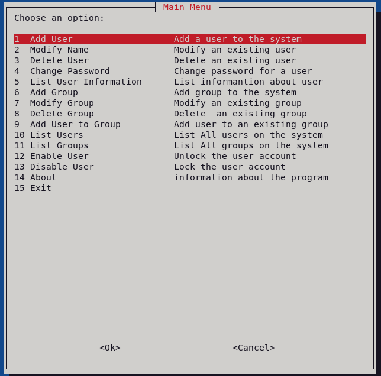

# User and Group Management Tool (Linux Administration)

## Overview
This project is a comprehensive **User and Group Management Tool** for Linux systems. It provides efficient, automated solutions for common administrative tasks, making system management faster and less error-prone.

The tool  designed for flexibility and ease of use:

1. **Bash (whiptail):** An interactive GUI-based tool using dialog boxes.

---

## Features
- Add, modify, and delete users/groups.
- List users and groups.
- Enable or disable users.
- Change passwords for users.
- GUI and CLI interfaces to suit various preferences.
- Automates repetitive tasks, improving efficiency.

---

## Tools Used
- **Whiptail Dialog Boxes:** To create interactive GUI elements for the tool.

---

## Implementations and Screenshots
 
### Bash (whiptail)
- **Description:** Uses dialog boxes for GUI interactions. Designed for users who prefer visual interfaces. Provides feedback for all operations.
- **Screenshot:**
  

---

 

## Installation and Usage
### Requirements
- Linux Operating System.
- Whiptail (pre-installed in many Linux distributions).

 
